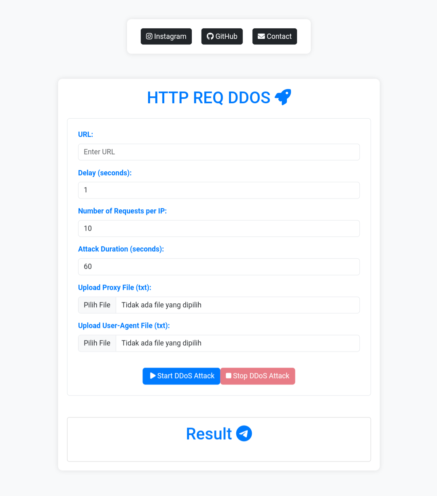

<h2 align="center">HTTP ExpressJS</h1>

<p align="center">
    
</p>

Its still the same as other `DDoS ​​HTTP Flood Requests`, in this version it just adds a web UI to make it more pleasing good. this is made with expressjs and still not fixed for serverless hosting experiments such as vercel, etc. if u want to try serverless, you can add scripted it yourself. cuz only here to make perpose educational lessons.

If u want it to be used so that everyone can use it, u can use `Ngrok` as a server to get it online thid script.

#### Requirements

```javascript
npm install express cloudscraper ws multer fs path
```

#### Installation

```javascript
npm install webjsflood && mv node_modules/webjsflood ./ && cd webjsflood
```

#### Lets try

```javascript
node app.js
```

#### Ngrok server

```javascript
ngrok http 3000
````